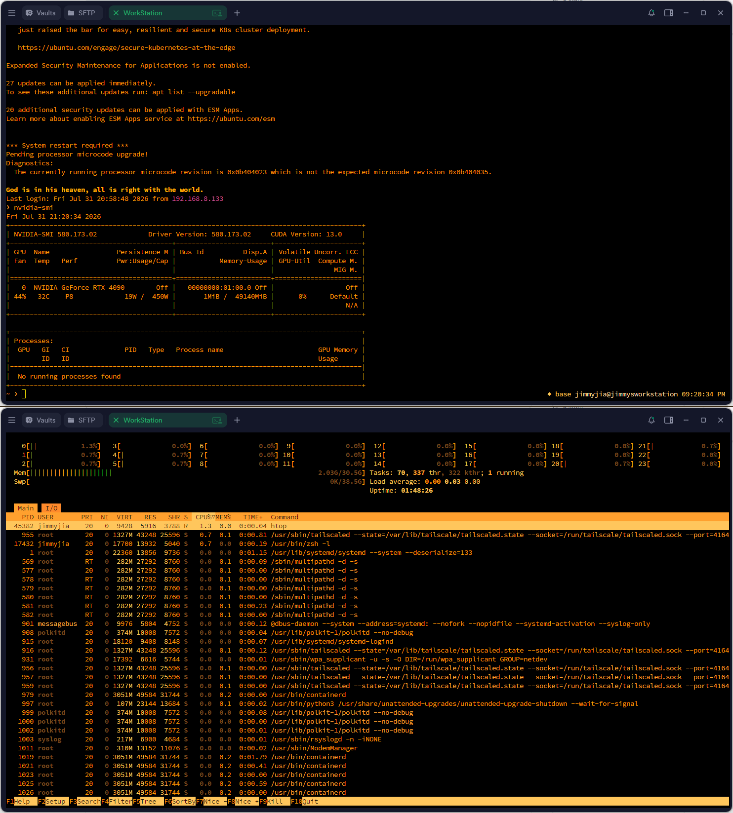
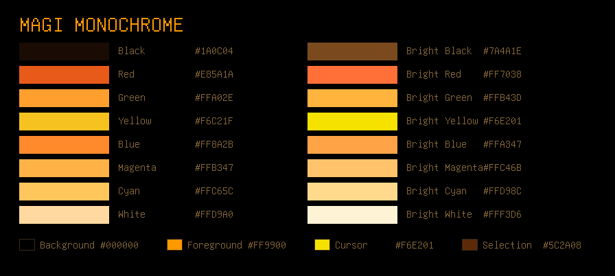
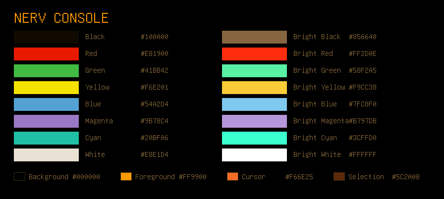
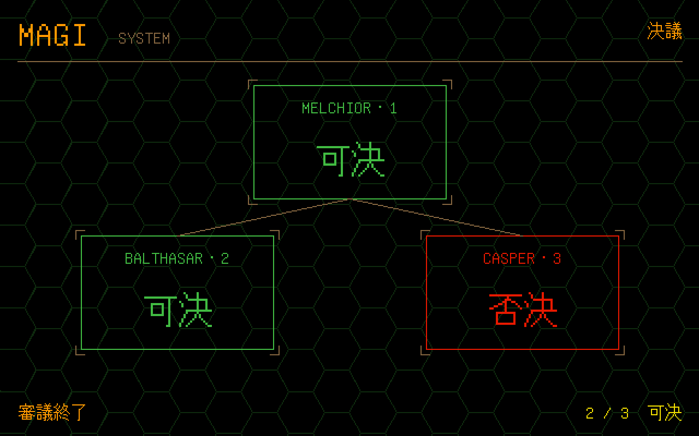
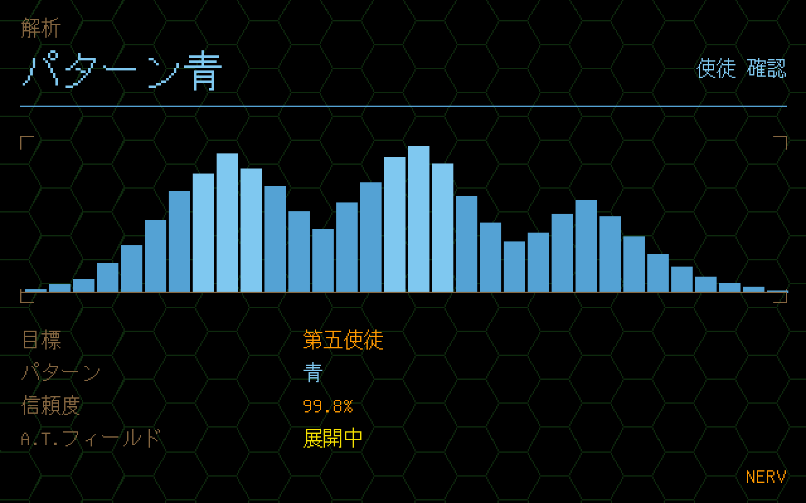
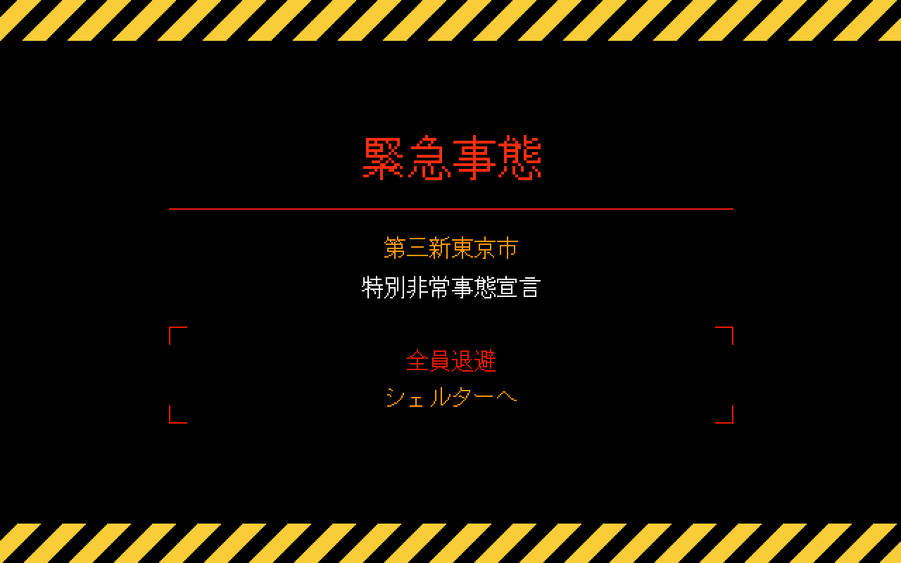
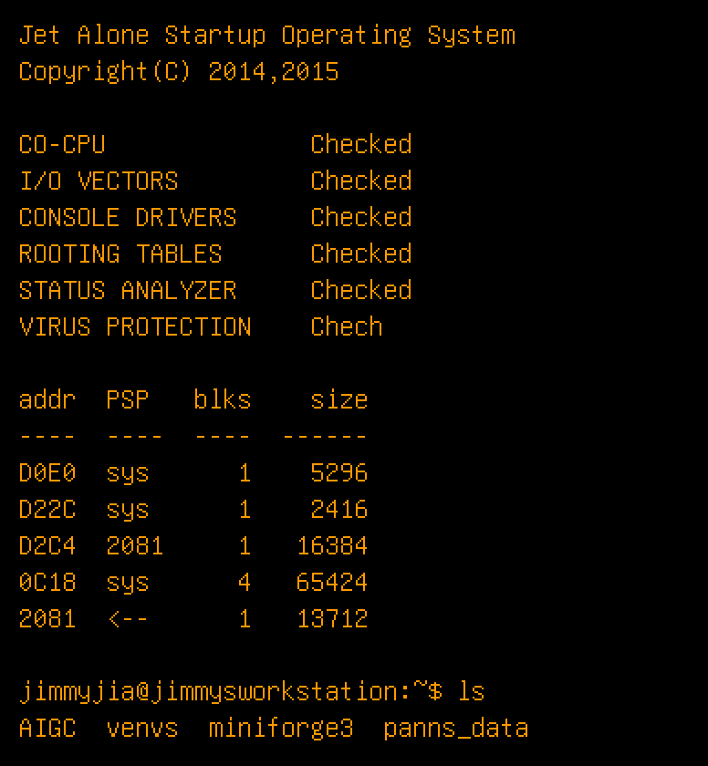
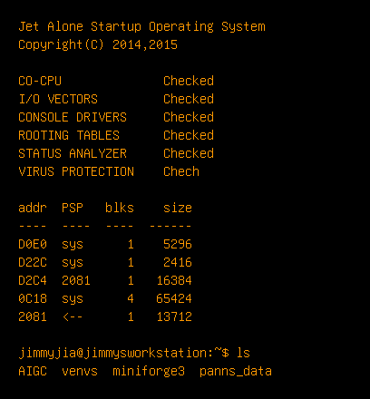

<div align="center">

# MAGI Terminal

[English](README.md) · **简体中文** · [日本語](README.ja.md)

**源自《新世纪福音战士》中 NERV 控制台画面的琥珀色终端配色 —— 外加一套洁净室实现的 PC-98 字体构建流程。**



</div>

---

## 这是什么

两套终端配色，以及一条字体构建流水线。

这些配色并不是「随便调个橙色，看起来有点动画感」。每一个色值都能追溯到画面上真实出现过的东西，或是四种官方配色之一；每一个色槽都经过对比度实测，而不是靠肉眼估。字体则是 NERV 显示屏所参照的、真实的 NEC PC-9801 ROM 字形，并且完全基于自由的洁净室素材构建，不涉及任何受版权保护的固件。

配色通过转义序列由你 SSH **登入的那台机器**下发，因此外观跟着工作站走，而不是躺在某一个客户端的设置里。

## 两套配色

### MAGI 单色 —— 默认

即 MAGI 那些琥珀底黑的文字画面。全部 16 个 ANSI 色槽都是同一条渐变带上的取样点，这条渐变带在两种官方配色之间插值：NERV 橙 `#F66E25` 与 EVA 黄 `#F6E201`。没有任何一个色不是琥珀色。



### NERV 控制台

琥珀色依然主导画面，但在《EVA》赋予色彩含义的地方保留色相。如果你整天都在读 `git diff` 或 `pytest` 的输出，请用这一套 —— 红与绿是开发工作中承载信息量最大的一组颜色，而单色方案会把它们压平。



## 安装

```bash
git clone https://github.com/JimmyToluene/magi-terminal.git ~/magi-terminal
cp ~/magi-terminal/magi.sh ~/.config/magi.sh
```

然后在**你 SSH 登入的那台机器**上，把下面这段追加到 `~/.zshrc`（或 `~/.bashrc`）：

```bash
if [[ -o interactive && -t 1 && $TERM != dumb && $TERM != linux ]]; then
  source ~/.config/magi.sh
fi
```

这些判断条件很重要。少了 `-t 1` 这一项，转义序列会被写进非 TTY 的数据流，从而破坏 `scp`、`rsync` 以及通过 SSH 执行的 `git`。

**如果你在用 Powerlevel10k，请把这段放在 p10k 的 instant prompt 代码块之前，而不是追加到文件末尾。** instant prompt 会捕获 `.zshrc` 写往控制台的所有输出，因此在它之后发出的转义序列永远到不了终端。这个失败是无声的，而且很容易被误判：登录时配色毫无反应，可事后手动 `source magi.sh` 却完全正常，看上去就像是客户端的问题。把调用丢到后台也没有用——子 shell 继承的是同一个被捕获的 stdout。

```bash
source ~/.config/magi.sh                # MAGI 单色（默认）
EVA_ACCENT=1 source ~/.config/magi.sh   # NERV 控制台
```

也可以直接把色值手动填进终端自带的主题编辑器 —— 参见 [服务端能控制什么、不能控制什么](#服务端能控制什么不能控制什么)。

## 配色依据

NERV 的屏幕并没有官方色值规范。那是赛璐璐与早期数字动画，不是一套 VI 系统。但有三样东西是**可考的**，本项目的一切都建立在它们之上：

- **四种官方配色**，自 1995 年沿用至今 —— 橙 `#F66E25`、黄 `#F6E201`、黑、白。
- **Gaia Notes 官方授权的 EVA 涂料系列**（EV-01 Eva Purple、EV-02 Eva Green、EV-06 Eva Red、EV-11 Eva Proto Yellow），确定了哪种颜色属于哪架机体。
- **设定中颜色本身的语义**，这一点最关键：**Pattern Blue（蓝色波形）意味着目标已被确认为使徒；Pattern Orange 则意味着 MAGI 无法判定。** NERV 屏幕的底色是黑色，上面覆盖着不断重复的**绿色**六边形网格。

最后这一点决定了整个设计。在《EVA》里，屏幕上的颜色是**信息**，不是装饰。所以在 NERV 控制台配色中，每个色槽的色相都有其来由：

| 色槽 | 色值 | 画面中的来源 |
|---|---|---|
| 背景 | `#000000` | 标题卡的纯黑 —— 是纯黑，绝不是「接近黑」 |
| 前景 | `#FF9900` | NERV 控制台正文文字 |
| 光标 | `#F66E25` | NERV 标志的官方橙 |
| 红 | `#E81900` | 警告红；贰号机 |
| 绿 | `#41BB42` | 初号机的条纹；屏幕上的六边形网格 |
| 黄 | `#F6E201` | 官方 EVA 黄；零号机试作型 |
| 蓝 | `#54A2D4` | **Pattern Blue** —— 使徒确认 |
| 品红 | `#9B78C4` | 初号机装甲紫 |
| 亮白 | `#FFFFFF` | Matisse EB 标题卡的白 —— 全表唯一的纯白 |

背景是 `#000000`，而不是柔化过的「接近黑」。标题卡与 MAGI 画面都是纯黑，一旦妥协，整个观感就垮了。

## 重建这些画面

这里没有复制任何一帧动画画面。`tools/make-nerv-screens.py` 只用上面这套配色，加上本仓库自己构建的 PC-9800 字体，在 640×400 的画布上从零绘制——那正是这些显示器所依据的 PC-9801 的原生分辨率——所以它们既是完全原创的素材，同时也是这套配色的实机演示。

```bash
python3 tools/make-nerv-screens.py -o images/
```

**MAGI 决议画面。** 三套系统、三次独立判断，而那唯一的一票反对是靠警报红标出的，不是靠形状或位置。投出否决的是 CASPER —— 承载赤木直子「作为女人」那一面的单元，这也正是 MAGI 陷入僵局能成为剧情装置、而非走个过场的原因。



**パターン青（蓝色波形）。** 全片对颜色最吃重的一次使用：蓝色意味着目标的波形与使徒吻合。这一屏就是 NERV 控制台配色存在的全部理由——蓝色若不是蓝色，这份读数就不再是信息。



**緊急事態。** 官方 EVA 黄的警戒斜纹压在标题卡黑上，宣言本身用警报红。



## 可读性

亮度是按**终端中的用途**分配的，而不是按某种颜色在片中出现的频率。

这一点值得单独说明，因为反过来做会得到一套很漂亮但读不了的配色。蓝色在《EVA》里很少见，照此推论应该把 4 号槽压暗 —— 但 4 号槽正是 `ls` 用来显示目录的颜色（`DIR=01;34`），是工作屏幕上被读得最多的彩色文本。本配色的早期版本把 4 号槽定在了对黑底 **2.8:1** 的对比度上。完全没法用。

现在每个色槽都经过实测。在 MAGI 单色中，只有「黑」与「亮黑」被允许后退：

| | 对 `#000000` 的对比度 |
|---|---|
| 目录（4 号槽） | **8.9:1** |
| 非后退色槽中的最低值 | 5.9:1 |
| 最高值 | 19:1 |
| 亮黑（界面装饰、注释） | 4.0:1 —— 有意压低 |

你可以用 WCAG 相对亮度公式自行验证任何配色；凡是对背景低于 4.5:1 的，都应当是一个有意识的决定。

## PC-9800 字体

第七话里 `Jet Alone` 的启动画面并不是随手画的 DOS 装饰。它以 **NEC PC-9800 系列**为原型 —— 那是当时日本占据主导地位的 PC 平台。开头几行与真实 PC-9801 的 BIOS 内存检测一致，而 `addr PSP blks size` 那张表则是 `VMAP.COM` 的输出，一个相当冷门的日本内存诊断工具。画面上的字形，是烧录在 PC-9801 ROM 中的 8×16 ANK 点阵字体。它带有粗衬线，这正是这块屏幕永远不会被看成「西方 DOS 窗口」的原因 —— IBM 的 VGA CP437 字体基本上是无衬线的。

[`hikaen2/ttf-pc9800`](https://github.com/hikaen2/ttf-pc9800) 可以把 PC-9801 的 `FONT.ROM` 转成 TrueType。**但该仓库自带的 `FONT.ROM` 是一个占位文件** —— 288,768 字节，内容全是 `0xFF`。它的大小完全正确，所以 `make` 会顺利跑完，然后产出一套每个字形都是实心方块的字体。

`tools/freecg98-to-fontrom.py` 彻底绕开了对 NEC 固件的需求。它读取 `FREECG98.BMP` —— 随 DOSBox-X 分发的自由洁净室 Anex86 兼容 PC-98 字体 —— 并按照 ttf-pc9800 解析器所期望的字节布局写出一份 `FONT.ROM`：

```bash
sudo apt install -y git make ruby fontforge-nox potrace bdfresize
git clone https://github.com/hikaen2/ttf-pc9800.git && cd ttf-pc9800
curl -sLO https://github.com/joncampbell123/dosbox-x/raw/master/contrib/fonts/FREECG98.BMP
python3 ../tools/freecg98-to-fontrom.py FREECG98.BMP -o data/FONT.ROM
make
```

产物位于 `dist/`，即 `pc-9800-regular.ttf` 与 `pc-9800-bold.ttf`。

用构建出的字体重现的 Jet Alone 启动画面，32px 与 16px：





两点提醒：

- **给产物设置 `post.isFixedPitch = 1`。** 所有拉丁字符的步进宽度统一为 512，PANOSE 也已声明等宽，但 FontForge 不会置上这个标志位 —— 而绝大多数应用在筛选「等宽字体」时看的正是它。不设置的话，字体可能根本不会出现在字体列表里。
- `FREECG98.BMP` 是**复刻**，不是 NEC 的 ROM。它保留了 PC-98 的气质与正确的 8×16 度量，但字形只是接近，并非完全一致。如果你需要精确复原，把真实硬件的 dump 放进去重新 `make` 即可。

该字体在其 16px 字身的整数倍处最为锐利。如果看起来发虚，请在 16 / 32 之间切换，而不是逐级微调。

## 服务端能控制什么、不能控制什么

终端外观是两台机器协商的结果，而各个客户端支持的子集差异极大。实际上可以分为三档：

| | ANSI 颜色（`OSC 4`） | 背景（`OSC 11`） | 字体 |
|---|---|---|---|
| xterm、kitty、Alacritty、iTerm2、GNOME Terminal、Windows Terminal | ✅ 自动 | ✅ 自动 | 客户端侧 |
| Termius | ✅ 自动 | ❌ 需在主题编辑器中设置（可跨设备同步） | 客户端侧 |
| MobaXterm（PuTTY 血统） | ❌ | ❌ | 客户端侧 |

**字体永远在客户端侧。** 服务端发送的是字节，渲染字形的是客户端。没有任何转义序列能改变这一点 —— 每一台设备都要各自安装该 TTF。

对于完全忽略 `OSC 4` 的客户端，请把色值填进它自己的颜色设置。用下面这条命令确认某个客户端属于哪一档：

```bash
printf '\033]4;1;#00FF00\007'; printf '\033[31m如果这行字是绿色的，说明 OSC 4 生效\033[0m\n'
```

## 致谢

- [EvaGeeks —— Jet Alone 启动画面](https://wiki.evageeks.org/FGC:Supplemental_Jet_Alone's_boot_screen) —— 确认了 PC-9800 原型与 `VMAP.COM`
- [Fonts In Use —— 新世纪福音战士](https://fontsinuse.com/uses/28760/neon-genesis-evangelion) —— Matisse EB 标题卡
- [hikaen2/ttf-pc9800](https://github.com/hikaen2/ttf-pc9800) —— ROM 转 TrueType 的流水线
- [DOSBox-X](https://dosbox-x.com/) —— `FREECG98.BMP`，洁净室 PC-98 字体
- Shinonome 16 —— 汉字覆盖，由 ttf-pc9800 自带

《新世纪福音战士》版权归 khara 所有。本项目为非官方同人作品，不包含任何受版权保护的素材。

## 许可证

MIT —— 参见 [LICENSE](LICENSE)。
